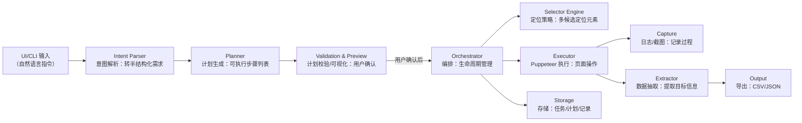

# Chrome Agent (Node + Puppeteer) - 产品文档优化版


## 产品概述  
Chrome Agent 是一款基于本地 Node.js + Puppeteer 的网页自动化智能工具，旨在通过**自然语言交互**简化网页操作流程。用户无需编写代码，即可生成可执行的自动化计划，完成页面导航、数据抽取、表单操作等任务，并支持结果导出、流程保存与复用。  

核心价值：降低网页自动化技术门槛，让非开发人员也能通过自然语言实现重复操作自动化，同时保证操作稳定性、可追溯性与合规性。


## 1. 项目目标与范围（MVP）  
### 核心能力  
- **自然语言转自动化计划**：用户输入中文/英文指令（如“爬取某电商页面的手机价格列表”），自动生成可执行的步骤列表，并支持可视化确认。  
- **基础网页操作全覆盖**：包括打开网页、点击按钮/链接、输入文本、选择下拉框、滚动页面、等待加载等。  
- **数据抽取与导出**：支持列表类数据（如表格、商品列表）的字段识别、抽取、清洗，并导出为 CSV/JSON 格式。  
- **稳定的元素定位**：通过多策略（文本、CSS、层级关系等）定位页面元素，自动选择最优方案，失败时触发备选策略。  
- **可靠的执行与监控**：内置错误处理（如元素未找到时重试）、超时管理、截图记录（关键步骤自动截图）、详细日志（可配置保存）。  
- **计划复用与参数化**：支持保存自动化计划为模板，下次使用时仅需修改参数（如目标网址、关键词）。  

### 非目标（MVP 之外）  
- 暂不支持复杂视觉识别（如验证码自动识别）、高强度反爬绕过（如指纹伪装）。  
- 默认禁用批量破坏性写操作（如批量删除数据、高频提交表单），需手动开启并确认风险。  


## 2. 技术栈与运行环境  
| 模块         | 技术选型                          | 说明                                  |  
|--------------|-----------------------------------|---------------------------------------|  
| 运行时       | Node.js LTS（≥ 18）               | 跨平台支持，兼容主流自动化库          |  
| 自动化引擎   | Puppeteer（或 puppeteer-core）    | 控制 Chrome/Chromium 浏览器，模拟用户操作 |  
| 开发语言     | TypeScript（优先）/ JavaScript    | 强类型支持，提升代码可维护性          |  
| 本地存储     | 文件系统（JSON/CSV/截图）         | 轻量易部署，后续可扩展至数据库        |  


## 3. 架构总览（方案A）  
采用本地进程内集成架构，所有模块（计划生成、执行、日志等）在同一应用进程内协作，通过 Puppeteer 受控启动浏览器实例，确保操作可追溯。  



### 架构说明  
1. **用户输入层**：支持 UI（图形界面）或 CLI（命令行）输入自然语言指令。  
2. **计划生成层**：解析用户意图，生成详细执行步骤，并通过可视化界面让用户确认/修改。  
3. **执行层**：由编排器协调定位、执行、抽取等模块，完成自动化流程，同时记录日志与截图。  
4. **输出层**：将抽取的数据导出为文件，并存档任务记录供后续查看。  


## 4. 模块划分与职责  
按“理解需求→生成计划→执行监控→结果输出”全流程划分模块，各模块职责清晰：  

### （1）需求理解层  
- **Intent Parser（意图解析）**：  
  - 将自然语言指令（如“打开百度，搜索‘天气’并截图”）转换为半结构化需求，包含：动作（打开、搜索、截图）、对象（百度页面、“天气”关键词）、约束（无特殊约束）。  
  - 支持识别模糊指令（如“爬取这个列表”），通过上下文补全缺失信息（如当前页面 URL）。  

### （2）计划生成层  
- **Planner（计划生成）**：  
  - 根据半结构化需求生成可执行的 Plan（步骤列表），每个步骤包含：动作（点击/输入等）、元素定位方案、参数（如输入文本）、等待条件（如页面加载完成）、容错策略（如重试次数）。  
- **Validation & Preview（计划校验/可视化）**：  
  - 以人类可读的方式展示步骤（如“1. 导航至 https://baidu.com；2. 点击搜索框并输入‘天气’”）。  
  - 提示潜在风险（如“目标页面可能有反爬，执行可能失败”），允许用户修改步骤参数或定位方案。  

### （3）执行与监控层  
- **Orchestrator（编排器）**：  
  - 负责自动化任务的全生命周期管理：启动/停止、断点续跑（支持中途暂停后继续）、超时控制（单步骤/整体任务超时）、重试逻辑（失败时按策略重试）、回滚提示（关键步骤失败时建议手动干预）。  
- **Selector Engine（定位引擎）**：  
  - 多策略生成元素定位器（候选列表），包括：文本匹配（如“按钮文字为‘登录’”）、role/aria属性（无障碍标签）、CSS选择器、层级关系（如“搜索框下方的按钮”）。  
  - 对候选定位器打分（唯一性、稳定性等），优先使用高分方案，失败时自动切换至备选。  
- **Executor（执行器，基于 Puppeteer）**：  
  - 封装 Puppeteer 核心操作：页面导航（`page.goto`）、点击（`page.click`）、输入（`page.type`）、滚动（`page.evaluate`）、等待条件（`page.waitForSelector`）等。  
  - 确保操作模拟真实用户（如输入速度控制、随机延迟）。  

### （4）结果处理层  
- **Extractor（数据抽取器）**：  
  - 识别页面列表结构（如表格、商品卡片列表），自动匹配字段（如“名称”“价格”），支持手动映射字段。  
  - 数据清洗（去重、格式标准化），并导出为 CSV/JSON。  
  - **增强数据抽取器**：提供智能数据提取和问答能力，基于AI分析自动识别和提取数据，可以回答关于提取数据的问题，并对提取的数据进行质量分析和洞察。  
- **Capture/Logging（日志/截图）**：  
  - 结构化日志：记录每个步骤的执行时间、状态（成功/失败）、错误信息。  
  - 截图配置：关键步骤（如点击前、失败时）自动截图，保存至本地。  
- **Storage（存储）**：  
  - 本地文件系统存储：任务记录（Task）、执行计划（Plan）、运行日志（Run）、自动化模板（Template）。  

### （5）输出层  
- **Output（输出）**：将抽取的数据、日志、截图按用户配置路径导出，支持查看历史记录。  


## 5. 目录结构（拟定）  
```  
/docs             # 产品文档、设计说明、使用手册  
/src  
  /core           # 核心框架：任务生命周期、事件总线、错误处理  
  /intent         # 意图解析模块：自然语言转半结构化需求  
  /planner        # 计划生成模块：步骤生成、策略选择  
  /selector       # 定位引擎：多策略定位器、候选打分  
  /executor       # 执行器：Puppeteer 操作封装  
  /extractor      # 数据抽取：列表识别、字段映射、导出  
  /storage        # 存储模块：本地文件读写（任务/计划/日志）  
  /ui             # 可视化界面（未来扩展）  
  /cli            # 命令行入口：支持通过指令启动任务  
/tests            # 测试用例：单元测试、场景测试  
/samples          # 示例计划模板：如“百度搜索”“电商数据爬取”  
```  


## 6. 核心数据结构（草案）  
| 结构       | 核心字段                                                                 | 说明                                                                 |  
|------------|--------------------------------------------------------------------------|----------------------------------------------------------------------|  
| **Task**   | `id, name, intent(自然语言指令), createdAt(创建时间), status(状态)`       | 记录用户发起的自动化任务基本信息                                     |  
| **Plan**   | `id, steps(步骤列表), riskLevel(风险等级), meta(元信息)`                  | 可执行计划，steps 包含每个操作的详细指令                             |  
| **Step**   | `id, action(动作), selectorCandidates(定位候选), params(参数), waitFor(等待条件), retries(重试次数)` | 单个执行步骤，如“点击按钮（定位：文本‘登录’，参数：无，等待：页面跳转）” |  
| **Run**    | `runId, taskId, startTime/endTime, status, logs(日志), screenshots(截图路径), output(输出路径)` | 任务运行记录，用于追溯执行过程                                       |  
| **Template** | `templateId, plan(计划), parametersSchema(参数 schema), version, owner`   | 可复用的计划模板，支持参数替换（如将“目标网址”设为变量）               |  


## 7. 接口设计（内部/未来对外）  
### 内部核心接口（模块间调用）  
- `generatePlan(intent: string, context?: Context): Plan`：输入意图与上下文，生成执行计划。  
- `executePlan(plan: Plan, config?: ExecuteConfig): Run`：执行计划，返回运行记录。  
- `extractData(page: Page, config: ExtractConfig): Data`：从当前页面抽取数据。  

### 未来对外接口（HTTP 扩展）  
- `POST /api/plan`：输入自然语言意图，返回计划详情（供前端展示）。  
- `POST /api/execute`：输入计划 ID 或模板 ID+参数，启动执行并返回运行 ID。  
- `GET /api/runs/:id`：查询指定运行 ID 的状态、日志、截图、输出数据。  


## 8. 核心特性详解  

### （1）元素定位稳定性  
- **多候选定位**：针对同一元素生成多个定位器（如“文本‘登录’”“CSS #login-btn”“父元素下的第2个按钮”），按稳定性打分（如唯一性高的定位器得分高）。  
- **智能回退**：主定位器失败时，自动尝试次优候选，直至成功或耗尽所有候选（此时触发人工干预提示）。  

### （2）错误处理与可靠性  
- **分层重试**：步骤级重试（如点击失败重试3次）、任务级重试（整体失败后重新执行）。  
- **超时管理**：全局超时（如任务最长运行30分钟）、步骤超时（如等待元素出现最多10秒）。  
- **失败留痕**：错误发生时自动截图（含页面状态）、记录详细日志（定位器、参数、错误栈），便于排查问题。  

### （3）数据抽取能力  
- **列表识别**：自动检测页面中的列表结构（如 `<ul>` `<table>` 或自定义布局的卡片列表）。  
- **字段映射**：支持手动指定字段（如“将‘价格’字段映射到页面中的￥xx元素”），或自动匹配常见字段（名称、日期、金额）。  
- **清洗规则**：内置基础清洗（去除空格、格式化日期），支持自定义规则（如“价格保留两位小数”）。  

### （4）增强数据抽取能力  
增强数据提取器是一个功能强大的数据提取工具，它提供了智能提取和问答能力：

- **智能数据提取**：基于AI分析自动识别和提取数据
- **问答能力**：可以回答关于提取数据的问题
- **AI分析**：对提取的数据进行质量分析和洞察
- **缓存机制**：内置AI调用缓存，提高性能
- **错误处理**：增强的错误处理和重试机制
- **数据验证**：自动验证和清洗提取的数据

详细使用说明请参考 [增强数据提取器使用指南](./docs/enhanced-data-extraction-guide.md)。


## 9. 安全与合规  
- **本地数据隔离**：所有操作与数据（日志、截图、导出文件）均存储在用户本地，不上传至云端，保障敏感信息安全。  
- **隐私保护**：默认不持久化保存 Cookie/LocalStorage，如需保存需手动开启并加密存储。  
- **合规约束**：默认限制高频/批量写操作（如1分钟内提交表单不超过5次），避免触发目标网站风控或造成破坏。  


## 10. 开发路线（分阶段）  
| 阶段 | 核心目标                                  | 关键功能落地                          |  
|------|-------------------------------------------|---------------------------------------|  
| M0   | 命令行原型可用                            | 自然语言转计划、基础执行、简单抽取    |  
| M1   | 提升可用性与可视化                        | 计划可视化预览、数据导出优化、日志截图 |  
| M2   | 增强稳定性与复用性                        | 模板化保存、参数化调用、定位策略优化  |  
| M3   | 扩展场景与体验                            | 轻量UI、定时任务、通知提醒            |  


## 11. 技术决策确认  
1. **开发语言**：✅ **已确定使用 TypeScript**（利于大型项目维护，提供强类型支持，提升代码可维护性）。  
2. **交互形态**：✅ **MVP 优先支持 CLI（命令行），后续扩展轻量 Web UI**（CLI 开发快速，满足初期需求，UI 后续提升易用性）。  
3. **存储方案**：✅ **采用本地文件系统存储**（轻量易部署，满足当前需求，敏感信息如账号密码采用加密存储）。  
4. **日志策略**：✅ **截图与日志按需开启**（节省存储空间，用户可根据调试需要灵活配置）。  


## 12. AI 配置与使用

Chrome Agent 支持统一的“OpenAI 兼容”调用接口：不论选择哪家 AI 提供商，内部都通过统一的 client.chat.completions.create(...) 完成调用。只需在 CLI 或配置中设置 provider、model、apiKey、baseUrl（按需），即可无缝切换。

- 基础概念
  - provider：AI 提供商，支持 openai | deepseek | modelscope | custom | google
  - model：所用模型名称（各 provider 的命名不同）
  - apiKey：对应 provider 的 API 密钥
  - baseUrl：可选，自定义 API 入口（部分 provider 必填，见下）

- 快速开始（CLI）
  - OpenAI
    - chrome-agent run "帮我打开百度并搜索北京天气" --ai \
      --provider openai \
      --model gpt-4o-mini \
      --apiKey $OPENAI_API_KEY
  - DeepSeek（若未指定 baseUrl，将默认使用 https://api.deepseek.com）
    - chrome-agent run "抓取页面中的标题列表" --ai \
      --provider deepseek \
      --model deepseek-chat \
      --apiKey $DEEPSEEK_API_KEY
  - ModelScope（必须提供 baseUrl）
    - chrome-agent run "列出商品价格并导出 CSV" --ai \
      --provider modelscope \
      --model qwen2-7b-instruct \
      --baseUrl $MODELSCOPE_BASE_URL \
      --apiKey $MODELSCOPE_API_KEY
  - Google Gemini（使用 OpenAI 兼容适配层，无需手动指定 baseUrl，若缺省将默认 https://generativelanguage.googleapis.com/v1beta）
    - chrome-agent run "生成一个简单的页面交互计划" --ai \
      --provider google \
      --model gemini-1.5-pro \
      --apiKey $GOOGLE_API_KEY
  - 自定义 OpenAI 兼容服务（必须提供 baseUrl）
    - chrome-agent run "访问页面并提取表格" --ai \
      --provider custom \
      --model my-model \
      --baseUrl https://my-openai-compatible.endpoint/v1 \
      --apiKey $AI_API_KEY

- 环境变量（CLI 未显式传入时的兜底）
  - 通用：AI_PROVIDER, AI_MODEL, AI_API_KEY, AI_BASE_URL
  - OpenAI：OPENAI_MODEL, OPENAI_API_KEY, OPENAI_BASE_URL
  - DeepSeek：DEEPSEEK_MODEL, DEEPSEEK_API_KEY, DEEPSEEK_BASE_URL
  - ModelScope：MODELSCOPE_MODEL, MODELSCOPE_API_KEY, MODELSCOPE_BASE_URL
  - Google：GOOGLE_MODEL 或 GEMINI_MODEL, GOOGLE_API_KEY 或 GEMINI_API_KEY, GOOGLE_BASE_URL

- 注意事项
  - provider=modelscope 或 custom 时，必须提供 baseUrl
  - provider=google 时，baseUrl 未配置将自动回退为 https://generativelanguage.googleapis.com/v1beta；model 需显式指定
  - 我们会在启动时进行一次连通性测试，若失败将提供错误提示

- 统一接口
  - 内部通过工厂方法创建客户端：根据 provider 选择 OpenAI SDK 或 Gemini 适配器
  - 您无需关心底层协议差异，始终以 chat.completions.create(...) 形式使用

如需扩展更多自定义提供商，可在 src/ai/client-factory.ts 中添加分支逻辑（设置默认 baseUrl 或校验必填项），保持返回对象兼容 OpenAI SDK 接口。


## 13. Open WebUI 集成

### 概述

Chrome Agent 现已启动API服务器，可以与 Open WebUI 进行集成，提供智能浏览器自动化功能。

### 快速开始

#### 使用 Docker Compose（推荐）

1. 确保已安装 Docker 和 Docker Compose
2. 在项目根目录运行：

```bash
docker-compose up -d
```

这将同时启动：
- Chrome Agent 服务（端口 3000）
- Open WebUI 界面（端口 8080）
- 自动配置的 Pipeline 集成

3. 访问 http://localhost:8080 开始使用

#### 手动部署

**服务状态**
- **Chrome Agent API**: http://localhost:3000
- **API 文档**: http://localhost:3000/docs
- **演示页面**: http://localhost:8888/demo.html

### 集成方式

#### 1. 通过 Open WebUI Pipelines 集成（推荐）

将 `chrome_agent_pipeline.py` 文件复制到 Open WebUI 的 pipelines 目录：

```bash
cp chrome_agent_pipeline.py /path/to/open-webui/backend/data/pipelines/
```

重启 Open WebUI 后，Pipeline 将自动加载。

**Pipeline 功能特性：**
- 🔍 自动检测浏览器相关任务
- 🌐 URL 自动识别
- 📊 数据提取优化
- ❌ 智能错误处理
- 🔄 任务状态反馈

**支持的关键词：**
- 中文: 打开网页、访问、浏览、提取数据、抓取、截图、点击、输入、搜索
- 英文: open website, visit, browse, extract, scrape, click, input, search, screenshot

#### 2. 作为 Open WebUI 的自定义工具

```python
# Chrome Agent 工具配置
import requests
import json

class ChromeAgentTool:
    def __init__(self):
        self.base_url = "http://localhost:3000"
    
    def execute_task(self, task_description, url=None):
        """执行浏览器自动化任务"""
        payload = {
            "task": task_description,
            "url": url,
            "format": "json"
        }
        
        response = requests.post(f"{self.base_url}/api/execute", json=payload)
        return response.json()
    
    def extract_data(self, url, selector=None):
        """从网页提取数据"""
        payload = {
            "url": url,
            "selector": selector
        }
        
        response = requests.post(f"{self.base_url}/api/extract", json=payload)
        return response.json()
```

### API 端点说明

#### 执行任务
```bash
POST /api/execute
Content-Type: application/json

{
  "task": "打开 https://example.com 并提取页面标题",
  "url": "https://example.com",
  "format": "json"
}
```

#### 数据提取
```bash
POST /api/extract
Content-Type: application/json

{
  "url": "https://example.com",
  "selector": "h1",
  "format": "json"
}
```

#### 聊天接口（流式）
```bash
POST /api/chat
Content-Type: application/json

{
  "message": "帮我打开百度搜索Python教程",
  "stream": true
}
```

### 使用示例

#### 在 Open WebUI 中的对话示例

**用户**: 帮我打开 GitHub 并搜索 "chrome automation"

**Chrome Agent**: 
✅ 任务执行完成
- 已打开 GitHub 网站
- 已在搜索框中输入 "chrome automation"
- 找到 1,234 个相关仓库
- 已截图保存到 /screenshots/github-search.png

**用户**: 提取前5个仓库的名称和描述

**Chrome Agent**:
✅ 数据提取完成
```json
[
  {
    "name": "puppeteer/puppeteer",
    "description": "Headless Chrome Node.js API",
    "stars": "87.2k"
  },
  {
    "name": "microsoft/playwright",
    "description": "Playwright is a framework for Web Testing and Automation",
    "stars": "64.1k"
  }
]
```

### 部署建议

1. **Docker 部署**：可以将 Chrome Agent 和 Open WebUI 一起部署在 Docker 容器中
2. **环境变量配置**：通过环境变量配置 Chrome Agent 的 API 地址
3. **安全考虑**：在生产环境中添加 API 认证和访问控制
4. **监控日志**：监控 Chrome Agent 的执行日志和性能指标

### 故障排除

#### Chrome Agent 问题
```bash
# 检查服务状态
curl http://localhost:3000/

# 查看日志
docker logs chrome-agent  # 如果使用 Docker
```

#### Open WebUI 问题
```bash
# 检查容器状态
docker ps | grep open-webui

# 查看日志
docker logs open-webui
```

## 14. 演示和测试

### 集成演示页面

访问 http://localhost:8888/demo.html 查看完整的集成演示，包括：

- 🎯 服务状态实时监控
- 🧪 Chrome Agent API 在线测试
- 📋 Pipeline 功能说明
- 🔗 快速访问链接

### 立即可用功能

1. **访问演示页面**: http://localhost:8888/demo.html
2. **测试 Chrome Agent API**:
   ```bash
   curl -X POST http://localhost:3000/api/execute \
     -H "Content-Type: application/json" \
     -d '{"task": "打开 https://example.com 并提取标题"}'
   ```

### Open WebUI 完成后

1. **访问 Open WebUI**: http://localhost:8080
2. **安装 Pipeline**:
   ```bash
   # 将 Pipeline 文件复制到 Open WebUI
   docker cp chrome_agent_pipeline.py open-webui:/app/backend/data/pipelines/
   docker restart open-webui
   ```
3. **开始使用**: 在 Open WebUI 中输入浏览器任务，Pipeline 会自动检测并转发给 Chrome Agent

## 15. 下一步

1. 在 Open WebUI 中安装并配置 Chrome Agent Pipeline
2. 测试浏览器自动化功能
3. 根据需要调整配置和权限设置
4. 添加更多自定义工具和功能
5. 探索更多集成可能性
